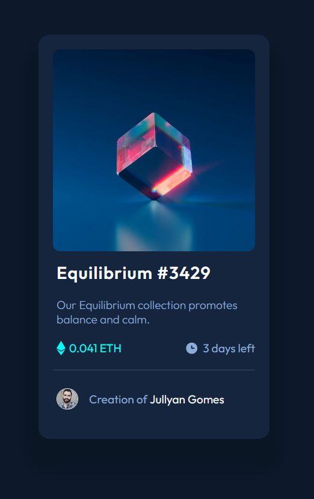

# Frontend Mentor - NFT preview card component solution

This is a solution to the [NFT preview card component challenge on Frontend Mentor](https://www.frontendmentor.io/challenges/nft-preview-card-component-SbdUL_w0U). Frontend Mentor challenges help you improve your coding skills by building realistic projects. 

## Table of contents

  - [Overview](#overview)
    - [Screenshot](#screenshot)
    - [Links](#links)
  - [My process](#my-process)
    - [Built with](#built-with)
    - [What I learned](#what-i-learned)
    - [Continued development](#continued-development)
  - [Author](#author)
  - [Acknowledgments](#acknowledgments)


## Overview

### Screenshot



### Links

- Solution URL: [https://github.com/jullyanvpr/nft-preview-card-component-main](https://github.com/jullyanvpr/nft-preview-card-component-main)
- Live Site URL: [https://boisterous-pika-792b23.netlify.app/]https://boisterous-pika-792b23.netlify.app/)

## My process

### Built with

- Semantic HTML5 markup
- CSS custom properties
- Flexbox
- Keyframes

### What I learned

I learned that I can use `border-radius` to create round images.

```css
.container__picAndText__pic {
    width: 30px;
    border-style: solid;
    border-width: 1px;
    border-color: white;
    border-radius: 50%;
    margin-left: 5px;
}
```

I was having trouble with alignment, but I learned that using `space-between` is more effective for responsive design than using `gap`.

```css
.container__ethAndDate {
    display: flex;
    justify-content: space-between;
    padding: 0 0 20px;
}
```

### Continued development

I would like to practice mobile-first workflow concepts and also CSS grid. I’m comfortable with using flexbox, but I haven’t used CSS grid yet.

## Author

- Github - [https://github.com/jullyanvpr](https://github.com/jullyanvpr)
- Frontend Mentor page - [https://www.frontendmentor.io/profile/jullyanvpr](https://www.frontendmentor.io/profile/jullyanvpr)

## Acknowledgments

I’d like to thank the developers community for all the free learning content and I’d like to thank frontendmentor’s staff and members.
